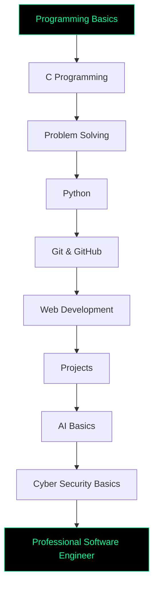

<div align="center">


<br><br>


</div>

---

<div align="center">

## 🧑‍💻 `CYBER PROFILE`

</div>


```bash
┌──(sowrov㉿github)-[~/profile]
└─$ whoami
```

```txt
Name        : MD Sowrov Miah
Username    : rtygfoth-gif
Role        : CSE Student
Focus       : Programming | Software Development | AI
Interest    : Cyber Security | Web Development | App Development
Goal        : Become a Professional Software Engineer
Status      : Learning and building every day
```

```bash
┌──(sowrov㉿github)-[~/mindset]
└─$ cat mission.txt
```

```txt
[+] Learn programming fundamentals
[+] Build real-world projects
[+] Improve problem solving
[+] Explore AI and cyber security
[+] Become job-ready step by step
[+] Never stop learning
```

<br clear="right"/>

---

<div align="center">

## ⚡ `CODING MODE: ACTIVE`


</div>

---

<div align="center">

## 🛠️ `TECH ARSENAL`

### Core Skills


<br><br>

### Exploring Next


</div>

---

<div align="center">

## 🧠 `LEARNING ROADMAP`

</div>



---

<div align="center">

## 🧪 `CURRENT SKILL STATUS`

| Skill | Status | Level |
|---|---|---|
| C Programming | `Learning` | Beginner |
| Python | `Learning` | Beginner |
| Git & GitHub | `Practicing` | Beginner |
| HTML / CSS | `Starting` | Beginner |
| JavaScript | `Upcoming` | Beginner |
| Linux Basics | `Interested` | Beginner |
| Cyber Security | `Exploring` | Beginner |
| AI / ML | `Future Goal` | Beginner |

</div>

---

<div align="center">

## 📊 `GITHUB INTELLIGENCE`


<br><br>


</div>

---

<div align="center">

## 📡 `ACTIVITY MONITOR`


</div>

---

<div align="center">

## 🏆 `ACHIEVEMENT SYSTEM`


</div>

---

<div align="center">

## 💻 `PROJECT LAB`


| Category | Project Idea |
|---|---|
| C Project | Student Result Management System |
| Python Project | Automation Tool |
| Web Project | Personal Portfolio Website |
| University Project | Course Management System |
| AI Project | Simple AI Chatbot |
| App Project | Student Helper App |
| Cyber Style Project | Password Strength Checker |

</div>

---

<div align="center">

## 🐍 `CONTRIBUTION SNAKE`


</div>

---

<div align="center">

## 🌐 `CONNECT WITH ME`

<a href="https://github.com/rtygfoth-gif">
  
</a>

<a href="mailto:your-email@example.com">
  
</a>

<a href="https://facebook.com/your-facebook-link">
  
</a>

<a href="https://linkedin.com/in/your-linkedin">
  
</a>

</div>

---

<div align="center">

## 💬 `TERMINAL QUOTE`

</div>

```bash
┌──(sowrov㉿future)-[~/success]
└─$ echo "I am not just learning code. I am building my future."
```

<div align="center">

> **“Every expert was once a beginner who refused to quit.”**

</div>

---

<div align="center">


### 🟢 `SYSTEM STATUS: ONLINE`

**Code • Learn • Build • Upgrade**

</div>
