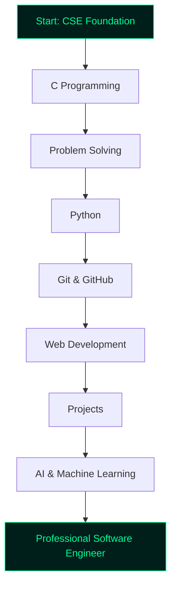

<div align="center">


<br>


</div>

---

<div align="center">

## 🟢 `SYSTEM PROFILE`

</div>


```bash
┌──(sowrov㉿github)-[~/profile]
└─$ whoami

Name        : MD Sowrov Miah
Role        : CSE Student
Focus       : Programming, Software Development, AI
Mindset     : Learn • Build • Break Limits
Status      : Upgrading skills daily
Goal        : Become a Professional Software Engineer
```

```bash
┌──(sowrov㉿github)-[~/mission]
└─$ cat goals.txt

[+] Master programming fundamentals
[+] Build real-world projects
[+] Learn web and app development
[+] Explore AI and machine learning
[+] Improve problem-solving skills
[+] Become job-ready step by step
```

<br clear="right"/>

---

<div align="center">

## ⚡ `TECH ARSENAL`

</div>

<div align="center">

### 🧩 Core Skills


<br><br>

### 🚀 Exploring Next


</div>

---

<div align="center">

## 🧠 `LEARNING ROADMAP`

</div>



---

<div align="center">

## 🧪 `CURRENT STATUS`

</div>

<div align="center">

| Module | Status | Level |
|---|---|---|
| C Programming | `In Progress` | Beginner |
| Python | `Learning` | Beginner |
| Git & GitHub | `Practicing` | Beginner |
| Web Development | `Starting Soon` | Beginner |
| AI / ML | `Exploring` | Beginner |
| Cyber Security Basics | `Interested` | Beginner |

</div>

---

<div align="center">

## 📊 `GITHUB INTELLIGENCE`

</div>

<div align="center">


<br><br>


</div>

---

<div align="center">

## 📡 `ACTIVITY MONITOR`

</div>

<div align="center">


</div>

---

<div align="center">

## 🏆 `ACHIEVEMENT UNLOCKED`

</div>

<div align="center">


</div>

---

<div align="center">

## 🧬 `PROJECT LAB`

</div>

<div align="center">

| Category | Project Idea |
|---|---|
| 🖥️ C Project | Student Result Management System |
| 🐍 Python Project | Automation Tool |
| 🌐 Web Project | Personal Portfolio Website |
| 📚 University Project | Course Management System |
| 🤖 AI Project | Simple AI Chatbot |
| 📱 App Project | Student Helper App |
| 🔐 Cyber Style Project | Password Strength Checker |

</div>

---

<div align="center">

## 🐍 `CONTRIBUTION SNAKE`

</div>

<div align="center">


</div>

---

<div align="center">

## 🌐 `CONNECT WITH ME`

</div>

<div align="center">

<a href="https://github.com/rtygfoth-gif">
  
</a>

<a href="mailto:your-email@example.com">
  
</a>

<a href="https://facebook.com/your-facebook-link">
  
</a>

<a href="https://linkedin.com/in/your-linkedin">
  
</a>

</div>

---

<div align="center">

## 💬 `TERMINAL QUOTE`

</div>

```bash
┌──(sowrov㉿future)-[~/success]
└─$ echo "I don't just learn code. I build my future with it."
```

<div align="center">

> **“Every expert was once a beginner who refused to give up.”**

</div>

---

<div align="center">


### 🟢 `SYSTEM STATUS: ALWAYS LEARNING`

**Code • Create • Improve • Repeat**

</div>
