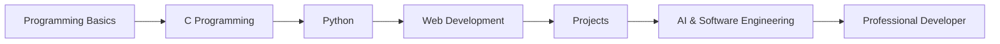

 

---

## 👨‍💻 About Me

Hi, I’m **MD Sowrov Miah**, a passionate **Computer Science and Engineering student** who loves learning programming, software development, and modern technology.

I am currently building my foundation in programming and exploring the world of **Artificial Intelligence, Web Development, App Development, and Software Engineering**.

### 🚀 What I’m Focused On

- 🎓 Studying **Computer Science and Engineering**
- 💻 Learning **C, Python, Git, GitHub, HTML, CSS, JavaScript**
- 🤖 Interested in **Artificial Intelligence and Machine Learning**
- 📱 Exploring **Android App Development**
- 🌐 Building knowledge in **Web Development**
- 🎯 Goal: Become a skilled **Software Engineer**
- 🔥 Mindset: **Learn, Build, Improve, Repeat**

 

---

## 🧠 My Learning Journey

---

## 🛠️ Tech Stack

### 💻 Programming & Development

  

### 🚀 Currently Exploring

---

## 📌 Current Goals

| 🎯 Goal | 📚 Status |
|---|---|
| Learn C Programming | In Progress |
| Learn Python | In Progress |
| Master Git & GitHub | In Progress |
| Build Beginner Projects | Starting |
| Learn Web Development | Upcoming |
| Explore AI & ML | Upcoming |

---

## 📊 GitHub Analytics

  

---

## 📈 Contribution Activity

---

## 🏆 GitHub Achievements

---

## 🐍 Contribution Snake

---

## 💼 Future Project Ideas

| Project Type | Idea |
|---|---|
| 🌐 Web Project | Personal Portfolio Website |
| 📚 Student Project | University Management System |
| 🛒 E-commerce | Simple Online Shop |
| 🤖 AI Project | AI Chatbot |
| 📱 App Project | Student Helper App |
| 🧮 C Project | Calculator / Result System |

---

## 🌐 Connect With Me

---

## ✨ Personal Quote

> **“Success does not come from comfort. It comes from learning, practicing, and never giving up.”**

---

### ⭐ Thanks for visiting my profile

**Keep Learning • Keep Building • Keep Growing**

