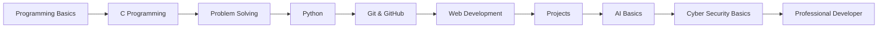

<div align="center">


<br><br>


</div>

---

<table>
<tr>
<td width="60%">

## 🧬 System Identity

```bash
┌──(sowrov㉿github)-[~/profile]
└─$ whoami
```

```yaml
Name       : MD Sowrov Miah
Username   : rtygfoth-gif
Role       : CSE Student
Focus      : Programming, AI, Software Development
Interest   : Cyber Security, Web Development, App Development
Mindset    : Learn → Build → Improve → Repeat
Status     : Always upgrading skills
```

```bash
┌──(sowrov㉿github)-[~/mission]
└─$ cat future.txt
```

```diff
+ Build real-world projects
+ Master programming fundamentals
+ Explore AI and cyber security
+ Become a professional software engineer
+ Never stop learning
```

</td>
<td width="40%" align="center">


</td>
</tr>
</table>

---

<div align="center">

## ⚔️ Tech Arsenal

### Core Skills


<br><br>

### Exploring Next


</div>

---

<div align="center">

## 🖥️ Terminal Dashboard

</div>

```bash
┌── STATUS REPORT ────────────────────────────────┐
│                                                 │
│  Learning Mode      : ACTIVE                    │
│  Coding Mode        : LOADING...                │
│  Problem Solving    : IN PROGRESS               │
│  AI Interest        : ENABLED                   │
│  Cyber Mindset      : ONLINE                    │
│  Future Goal        : SOFTWARE ENGINEER         │
│                                                 │
└─────────────────────────────────────────────────┘
```

---

<div align="center">

## 🧠 Learning Roadmap

</div>



---

<div align="center">

## 📊 GitHub Intelligence


<br><br>


</div>

---

<div align="center">

## 📡 Activity Monitor


</div>

---

<div align="center">

## 🏆 Achievement Matrix


</div>

---

<table>
<tr>
<td width="50%">

## 🔬 Project Lab

| Category | Project Idea |
|---|---|
| C Project | Student Result System |
| Python | Automation Tool |
| Web | Portfolio Website |
| University | Course Management System |
| AI | Simple AI Chatbot |
| Cyber Style | Password Strength Checker |
| App | Student Helper App |

</td>
<td width="50%" align="center">


</td>
</tr>
</table>

---

<div align="center">

## 🌐 Connect Protocol

<a href="https://github.com/rtygfoth-gif">
  
</a>

<a href="mailto:your-email@example.com">
  
</a>

<a href="https://facebook.com/your-facebook-link">
  
</a>

<a href="https://linkedin.com/in/your-linkedin">
  
</a>

</div>

---

<div align="center">

## 💬 Developer Quote

```bash
┌──(sowrov㉿future)-[~/success]
└─$ echo "I am not just learning code. I am building my future."
```

**Every expert was once a beginner who refused to quit.**

</div>

---

<div align="center">


### `SYSTEM STATUS: ONLINE`

**Code • Learn • Build • Upgrade**

</div>
